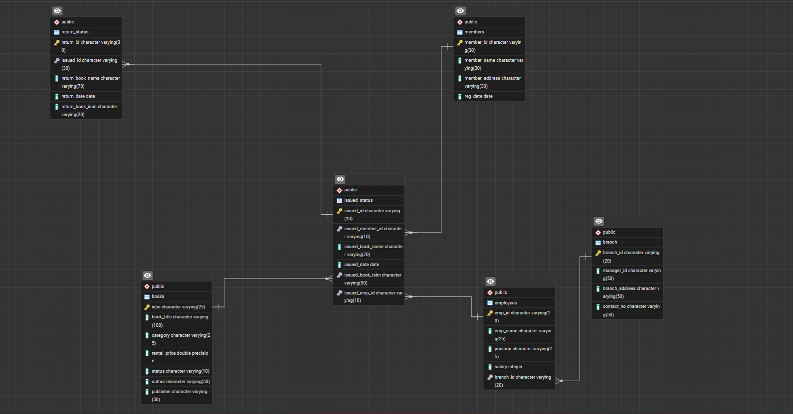

# Library_management_analysis_sql Project

## Project Overview
This project demonstrates the design and analysis of a Library Management System using SQL. It includes database creation, data manipulation, and advanced queries to extract meaningful insights.

---

## Objectives
- Design relational database schema
- Perform CRUD operations
- Analyze library data using SQL queries
- Generate insights on book usage and member activity

---

## Project Structure
- ** Database setup

- **Database Creation**: Created a database named `library_db`.

- **Table Creation**: Created tables for branches, employees, members, books, issued status, and return status. Each table includes relevant columns and relationships.

## Tools Used
- SQL (PostgreSQL)
- Database Design
- Joins, Aggregations, CTAS, Stored Procedures

---

## Key Insights
- Identified most frequently issued books and categories  
- Analyzed member activity and borrowing patterns  
- Detected overdue books and calculated fines  
- Evaluated branch performance based on issued and returned books  

---

## Key Features
- Database creation with multiple related tables  
- Advanced queries using JOIN, GROUP BY, HAVING  
- Stored procedures for issuing and returning books  
- Performance analysis using SQL  

---

## Project Files
- `schema.sql` – Contains database and table creation scripts 
- `analysis_queries.sql` – SQL queries for analysis  

---

## How to Use
1. Create database  
2. Run SQL scripts  
3. Execute queries for analysis  

---

## Author
Diksha Zope
